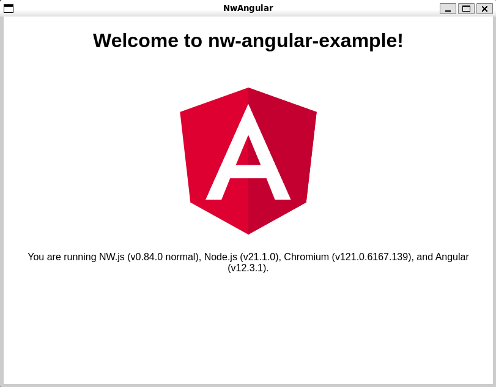

# NW.js and Angular CLI example

This project was generated with [Angular CLI](https://github.com/angular/angular-cli) version 8.0.3.

## Running Locally for development

1. `npm install`
1. `npm start`
1. An empty window will pop up while Webpack warm ups
1. Once Webpack is running, refresh the window and you're golden

## Building for distribution

1. `npm run build:clean` will delete your `./dist` and `/dist-ng` folders
1. `npm run build:ng` will build just your Angular app for distribution (`./dist-ng`)
1. `npm run build:nw` will build just your NW.js app (`./dist`)
1. `npm run build` is your all-in-one command. It will clean out the old dist folders and build your Angular and NW.js app

# **IMPORTANT NOTE ABOUT BUILDS!!!**

They take a long time. If you do `npm run build` expect it to take 10-15 minutes. This can be changed based on changing the build params in the `package.json`.

* * *

The following instructions came from the Angular CLI, I haven't tested them yet though.

* * *

## Code scaffolding

1. `npm install -g @angular/cli`
1. Run `ng generate component component-name` to generate a new component. You can also use `ng generate directive|pipe|service|class|guard|interface|enum|module`.

## Running unit tests

Run `ng test` to execute the unit tests via [Karma](https://karma-runner.github.io).

## Running end-to-end tests

Run `ng e2e` to execute the end-to-end tests via [Protractor](http://www.protractortest.org/).

## Further help

To get more help on the Angular CLI use `ng help` or go check out the [Angular CLI README](https://github.com/angular/angular-cli/blob/master/README.md).
